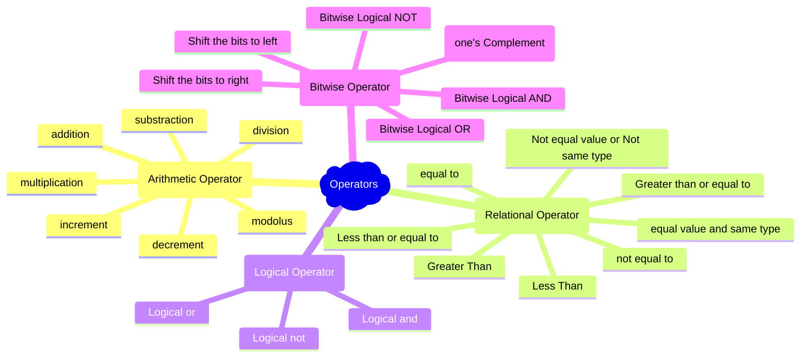
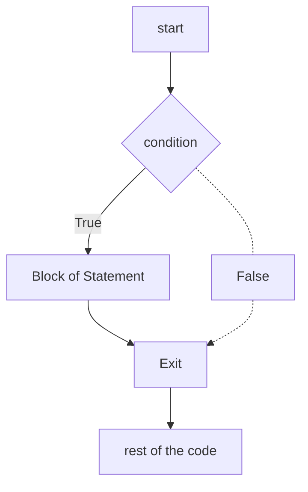
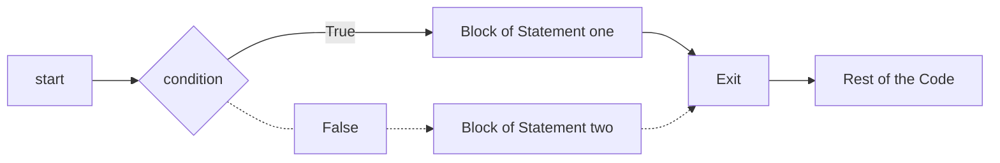
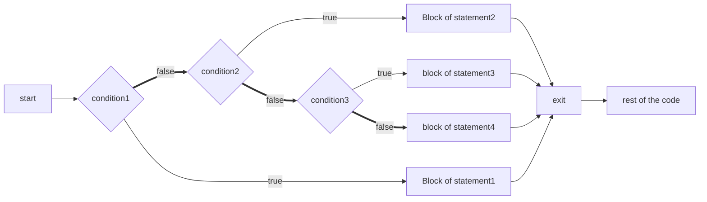
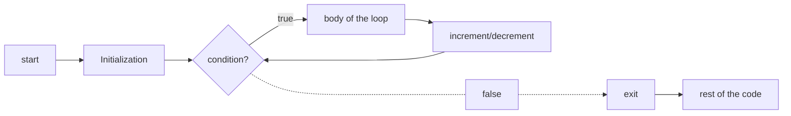

```mermaid
mindmap
	root)Operators(
		(Arithmetic Operator)
			addition
			substraction
			multiplication
			division
			modolus
			increment
			decrement
		(Relational Operator)
			Less Than
			Greater Than
			Less than or equal to
			Greater than or equal to
			equal to 
			not equal to
			equal value and same type
			Not equal value or Not same type
		(Logical Operator)
			Logical and
			Logical or
			Logical not
		(Bitwise Operator)
			Shift the bits to left
			Shift the bits to right
			Bitwise Inversion (one's Complement)
			Bitwise Logical AND
			Bitwise Logical OR
			Bitwise Logical NOT			
```

**IF Statement**

```mermaid
flowchart TD
A[start] --> B{condition}
B -- True --> C[Block of Statement]
C --> D[Exit]
B -.- False -.-> D
D --> e[rest of the code]
```

**IF else Statement**

```mermaid
flowchart LR
A[start] --> B{condition}
B -- True --> C[Block of Statement one]
C --> D[Exit]
B -.- False -.-> e[Block of Statement two]
e -.-> D
D --> F[Rest of the Code]
```

**Else if Statement**

```mermaid
flowchart LR
a[start] --> b{condition1}
b -- true --> c[Block of statement1]
b == false ==> f{condition2}
f -- true --> g[Block of statement2]
f == false ==> h{condition3}
g --> d
h -- true --> j[block of statement3]
j --> d
h == false ==> i[block of statement4]
i --> d
c --> d[exit]
d --> e[rest of the code]
```

**For Loop**

```mermaid
flowchart LR
A[start]--> b[Initialization]
b --> c{condition?}
c -- true --> d[body of the loop]
d --> e[increment/decrement]
e --> c
c -..- false -..-> f[exit]
f --> g[rest of the code]
```